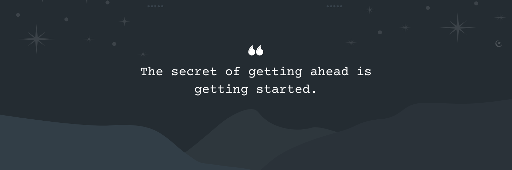

<h1 align="center">
  
   
  Hi 👋 , I'm @Chathupachamika 
  
</h1>

<h3 align="center"> 
  
</h3>

  

  

 

<h2 align="center">👨‍💻 About Me </h2>

<table>
<tr>
<td width="60%">

## 🎯 Quick Facts
- ⚡ Currently learning **MERN Stack**
- 🌱 Recent graduate from **ICET Institute**, university-bound
- 👨‍💻 Check out my [Portfolio](http://portfolio20041119.s3-website.eu-north-1.amazonaws.com/)
- 💬 Ask me about **Java, JavaScript, Angular & Spring Boot**
- 📫 Reach me at **Chathupachamika765@gmail.com**

## 🔭 Current Focus

### 🎯 Full Stack Development with PHP

- Exploring scalable solutions for modern web applications with PHP-based architectures

- Implementing robust backend services using PHP design patterns and best practices

</td>
<td width="40%">

</td>
</tr>
</table>

---

## 🏆 GitHub Trophies

---

# 📊 GitHub Stats:

  
  
  

---

## 🌐 Connect With Me

  
  
  
   
  

---

## 🛠️ Languages and Tools

### **Languages**

### **Frameworks**

  
  
  
  
  
  
  
  
  
  

### **Databases**

  
  
  

### **Cloud Computing**

### **Version Control**

### **Developing Tools**

---

## 🫶 Support My Work

  
  

Your support inspires me to create more awesome projects! 💖

---

### ✍️ Random Dev Quote

  

<table>
  <tr>
    <td width="60%">
      <h2>🔝 Top Contributed Repo</h2>
      
    </td>
    <td width="40%">
      
    </td>
  </tr>
</table>

---

